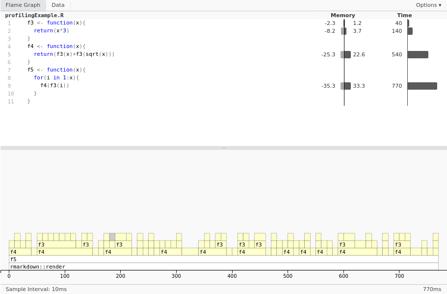

```{r setup, include=FALSE}
knitr::opts_chunk$set(echo = TRUE)
knitr::opts_chunk$set(tidy.opts=list(width.cutoff=80), tidy=TRUE)
```

# Performance and Bugs

In this portfolio we will discuss some general techniques for improving and analysing `R` code within RStudio, however, these techniques will be widely applicable to other programming languages and IDEs.

## Debugging

Bugs are inevitable during development of non-trivial code. Luckily IDEs usually come with tools that can help speed up the identification and correction of bugs.

Errors in syntax are often picked up by a spell-check or similar mechanism in the editor, and if not, you will hopefully receive an informative error message when trying to run your program. Logical errors, however, cannot usually be detected automatically, meaning that you will have to follow the logic of your program in order to detect the problem yourself (ideally you can produce a 'minimal working example' to begin zeroing in on the part of the code that actually produces the bug). You can of course do this by inserting lots of 'print' statements, allowing you to see the state of variables at different points during runtime, and often this will be sufficient to fix your problem, though a more detailed runtime analysis can be achieved through the IDE's built-in *debugger*.

In RStudio, given the following buggy code we can first examine the error message and then also see the call stack that led to the error by typing `traceback()`.

```{r, error=TRUE}
f1 <- function(arr1, arr2, i){
  if (arr1[i] == arr2[i]){
    cat("Match at index", i, "\n")
  }
}

f2 <- function(arr1, arr2){
  for(i in 1:4){
    f1(arr1, arr2, i)
  }
}
f2(1:4, c(1,3,2))
```
```
traceback()  # This would be typed in the terminal afterwards to produce the following output:
```
```
6: f1(arr1, arr2, i) at .active-rstudio-document#9
5: f2(1:4, c(1, 3, 2)) at .active-rstudio-document#12
4: eval(ei, envir)
3: eval(ei, envir)
2: withVisible(eval(ei, envir))
1: source("~/.active-rstudio-document")
```
In this case we see that the error occurs inside the function "f1", to which we can add a print statement to check the value of $i$ at which the error occurs:
```{r, error=TRUE}
f1 <- function(arr1, arr2, i){
  print(i)
  if (arr1[i] == arr2[i]){
    cat("Match at index", i, "\n")
  }
}

f2(1:4, c(1,3,2))
```

Now that we know the error occurs when `i` is `4`, we can run `browser()` to open a debugger at this point, which will allow us to move through the program step by step and investigate the value of any variable at each step:
```{r, error=TRUE}
f1 <- function(arr1, arr2, i){
  if(i==4) browser()
  
  if (arr1[i] == arr2[i]){
    cat("Match at index", i, "\n")
  }
}

f2(1:4, c(1,3,2))
```
The usage of the debugger can be seen using the `help` command:
```{r}
help(browser)
```
This shows us the following options available within the browser:
```
c
  exit the browser and continue execution at the next statement.

cont
  synonym for c.

f
  finish execution of the current loop or function

help
  print this list of commands

n
  evaluate the next statement, stepping over function calls. For byte compiled 
  functions interrupted by browser calls, n is equivalent to c.

s
  evaluate the next statement, stepping into function calls. Again, byte compiled
  functions make s equivalent to c.

where
  print a stack trace of all active function calls.

r
  invoke a "resume" restart if one is available; interpreted as an R expression 
  otherwise. Typically "resume" restarts are established for continuing from user 
  interrupts.

Q
  exit the browser and the current evaluation and return to the top-level prompt.
```
## Profiling
Another tool for code analysis is *profiling*, which helps us to see which parts of our code the program spends the most amount of time in.
We can do this through *instrumtenting profilers* which often work by incrementing counters based on the frequency of certain events within the code, however, we'll quickly examine the `R` package `profvis`, which is a statistical profiler.
Statistical profilers regularly interrupt the program every few milliseconds and makes note of which line of code is currently being run and thus can be seen as a Monte Carlo method.

```{r, eval=FALSE}
library(profvis)
source("profilingExample.R", keep.source=TRUE)
profvis(f5(1000000))
```

(Note that the output above is a screenshot of an interactive profiling display since `profvis` generates HTML output that cannot easily be included when an RMardown file is rendered to PDF.)

Once we have this information available to us we can examine the performace of the code more closely and hopefully identify which regions it will be useful to spend time improving. 
The actual methods by which we might try to improve this code will rely heavily on the particular problem at hand, however, it is often useful to think about the low-level implementation being used (e.g. how are matrices being stored and will this affect the speed of matrix multiplication?) and whether that might produce computational bottlenecks.
In particular, if performance is an important issue you may want to think about using `Rccp` to write C++ code that can be called from `R` as this will usually be much faster than pure `R`.